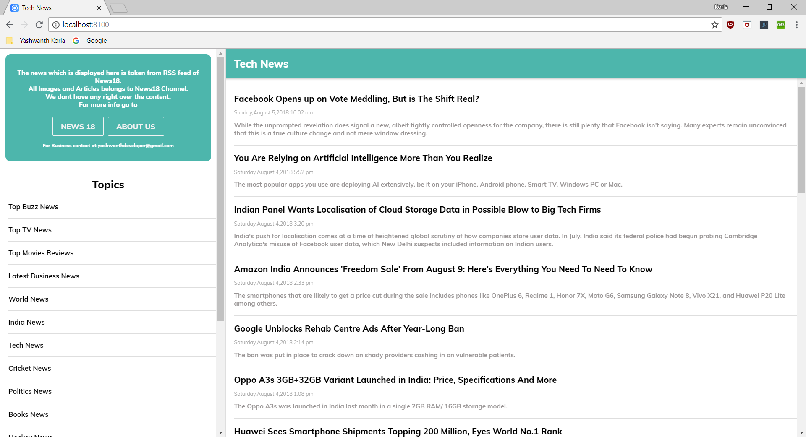
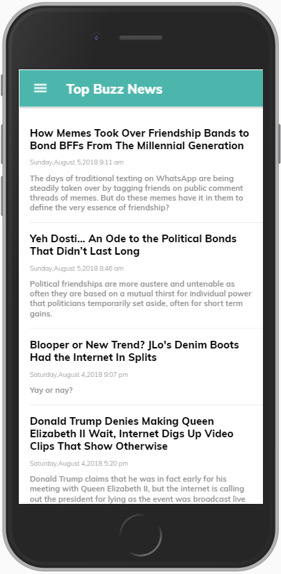
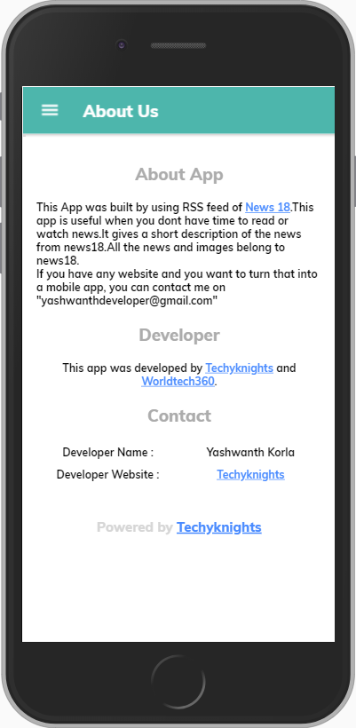

# KYNews - An App Made using RSS feed of News18 Channel

Author/Developer - **Yashwanth Korla**.

This app (Hybrid app) is made using ionic framework.The news which is shown in the app is not owned by me.It is owned by **News18 Channel**.I own only the design of the app.

I Used the RSS feed of the news18. The RSS feed is in the form of xml. I used xml2js plugin to convert xml to javascript objects.The app consist of 17 different types of news.

## Install [xml2js](https://www.npmjs.com/package/xml2js) plugin:
```
npm install xml2js
```
## Install [node_modules](https://www.npmjs.com/package/node-modules) package:
```
npm install -g node-modules (g for global)
```
## To run the code in your browser
Make sure you have ionic cli on your system.Once you have it, you can enter the below command

```
To launch the app in the browser : ionic serve

To launch the app in the simulator(Android/ios) - ionic cordova run android/ios --livereload 

(Livereload is do reload the app in the simulator whenever there is a change in the code)
```
## ScreenShots
### Desktop ScreenShots


### Mobile Screenshots





**If you want an app similar to this for your blog/website, you can reach out to me at yashwanthdeveloper@gmail.com** 
